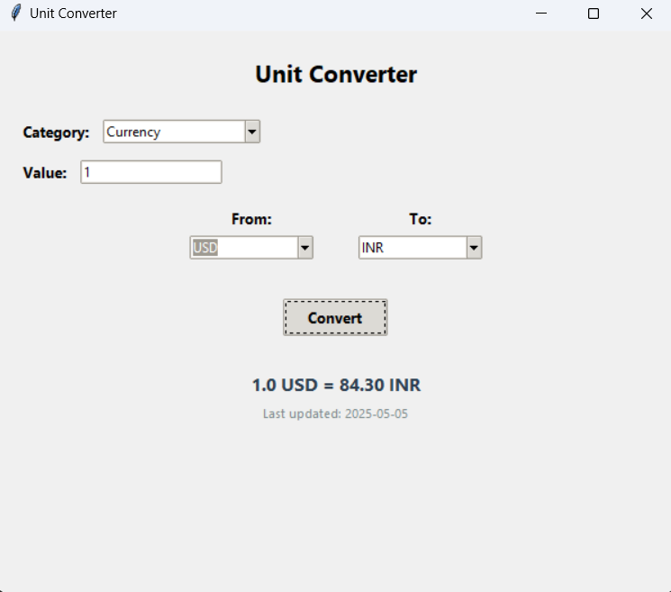

# Unit Converter with Currency Feature

A comprehensive unit converter application that supports length, weight, temperature, and currency conversions with real-time exchange rates.

## 🖼️ Screenshot

### Main Screen



## Features

- Length conversion (meters, kilometers, feet, inches, etc.)
- Weight conversion (kilograms, grams, pounds, ounces, etc.)
- Temperature conversion (Celsius, Fahrenheit, Kelvin)
- Currency conversion with real-time exchange rates
- User-friendly GUI interface
- Last updated timestamp for currency conversions

## Requirements

- Python 3.x
- tkinter (usually comes with Python)
- requests library

## Installation

1. Clone or download this repository
2. Install the required packages:
   ```bash
   pip install requests
   ```

## Usage

1. Run the converter:
   ```bash
   python converter.py
   ```

2. Select the conversion category (Length, Weight, Temperature, or Currency)
3. Enter the value to convert
4. Select the "From" and "To" units
5. Click the "Convert" button
6. View the result and (for currency) the last update timestamp

## Notes

- Currency conversion uses the free exchangerate.host API
- Internet connection is required for currency conversion
- All other conversions are performed locally

## License

This project is open source and available under the MIT License. 
